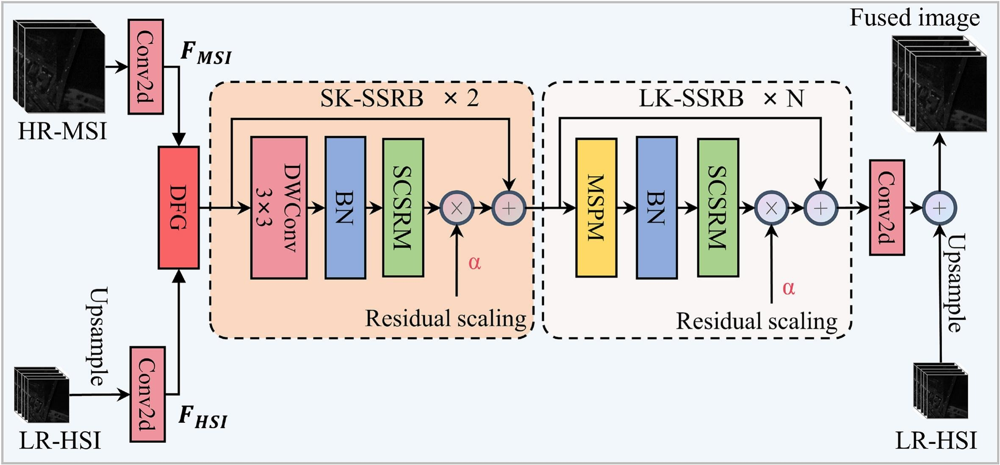

# SCSRNet: A multi-scale spatial-conditioned spectral routing network for hyperspectral and multispectral image fusion

PyTorch implementation of:

> **SCSRNet: A multi-scale spatial-conditioned spectral routing network for hyperspectral and multispectral image fusion**
> *International Journal of Applied Earth Observation and Geoinformation*, 2026.
> [https://doi.org/10.1016/j.jag.2026.105547](https://doi.org/10.1016/j.jag.2026.105547)

## Overview

**SCSRNet** is a multi-scale spatial-conditioned spectral routing network for hyperspectral and multispectral image fusion (HMIF). It fuses a low-resolution hyperspectral image (LR-HSI) with a high-resolution multispectral image (HR-MSI) to reconstruct a high-resolution HSI.

The network is built around three key designs:

- **Dynamic Fusion Gate (DFG)** — adaptively balances HSI and MSI contributions based on local spatial characteristics.
- **Large-Kernel Spatial–Spectral Residual Block (LK-SSRB)** — a Multi-Scale Spatial Perception Module (MSPM) captures spatial context with large receptive fields, while a Spatial-Conditioned Spectral Routing Module (SCSRM) dynamically establishes spectral dependencies guided by spatial priors.
- **Residual Scaling Connection (RSC)** — improves optimization stability and feature propagation.


<p align="center">
  
</p>

## Motivation: Computational Complexity and Depthwise Convolution

For an intermediate feature map with spatial size $H \times W$ and $C$ channels, let $N=HW$ denote the number of tokens, $K \times K$ the convolution kernel size, and $M \times M$ the Swin Transformer window size. Assuming $C_{\text{in}}=C_{\text{out}}=C$, the computational complexity in terms of MACs is summarized in Table 1.

**Table 1. Computational complexity of different operations.**

| Operation | MACs | Complexity |
|---|---:|---:|
| Standard convolution | $H W C^2 K^2$ | $O(HW C^2 K^2)$ |
| Global self-attention | $4H W C^2 + 2(HW)^2 C$ | $O(HW C^2 + (HW)^2 C)$ |
| Swin Transformer attention | $4H W C^2 + 2H W M^2 C$ | $O(HW C^2 + HW M^2 C)$ |
| Swin Transformer full layer | $12H W C^2 + 2H W M^2 C$ | $O(HW C^2 + HW M^2 C)$ |
| Depthwise convolution | $H W C K^2$ | $O(HW C K^2)$ |
| Depthwise separable convolution | $H W C K^2 + H W C^2$ | $O(HW C(K^2+C))$ |
| Depthwise $K\times K$ + our channel-wise $k\times 1$ conv (out=1) | $H W C K^2 + H W Ck$ | $O(H W C(K^2+k))$ |

With settings $K=3$, $K=13$ and $M=7$, the comparison becomes Table 2.

**Table 2. MACs under common settings.**

| Operation | MACs |
|---|---:|
| Standard convolution $3\times3$ | $9 H W C^2$ |
| Global self-attention | $4H W C^2 + 2H^2W^2 C$ |
| Swin Transformer full layer, $M=7$ | $12H W C^2 + 98 H W C$ |
| Depthwise convolution $3\times3$ | $9 H W C$ |
| Depthwise convolution $13\times13$ | $169 H W C$ |
| Depthwise $13\times13$ + our channel-wise $7\times1$ conv (out=1) | $176 H W C$ |

This comparison provides the main motivation for the lightweight design of SCSRNet:

- **Standard convolution** couples spatial and channel mixing, and its cost grows quadratically with the channel number, i.e., $O(HW C^2 K^2)$. When $C$ is large, which is common in hyperspectral and multispectral image fusion, this term becomes a dominant computational bottleneck.
- **Global self-attention** introduces token-wise interactions with an additional $O((HW)^2 C)$ term. For high-resolution remote sensing images, $N=HW$ is large, making global attention prohibitively expensive.
- **Swin Transformer** restricts attention to local windows and reduces the attention cost to $O(HW M^2 C)$. However, its full layer still contains projection and MLP costs of $O(HW C^2)$, and the window partitioning, shifting, and masking operations add extra implementation overhead.
- **Depthwise convolution** performs spatial filtering independently for each channel, requiring only $O(HW C K^2)$. For the same kernel size, it is approximately $C$ times cheaper than standard convolution. More importantly, its cost remains linear in the channel number $C$, allowing large kernels to be used for large receptive fields without the quadratic channel cost.
- **Channel-wise $k\times 1$ convolution with one output channel** further aggregates the depthwise responses along the channel dimension. Its cost is only $O(kHWC)$, which also remains linear in $C$. For $K=13$ and $k=7$, the combined large-kernel depthwise branch costs about $176HWC$ MACs, still far cheaper than standard convolution when $C$ is large.

## Environment

Tested with **CUDA 11.8 + Python 3.9 + PyTorch 2.0**.

```bash
# Option 1: conda (recommended)
conda env create -f environment.yml
conda activate lk

# Option 2: pip + PyTorch with cu118
pip install torch==2.0.0 torchvision==0.15.1 torchaudio==2.0.1 \
    --index-url https://download.pytorch.org/whl/cu118
pip install einops timm kornia opencv-python scipy numpy tifffile \
    matplotlib pandas wandb tensorboard torchsummary torchstat
```

> **Note on GDAL:** GeoTIFF I/O relies on `gdal` (`from osgeo import gdal`). If on windows platform, you need to build GDAL from wheel.

## Data Preparation

Datasets should be placed under the `datasets/` directory. Both `.mat` and `.tif` formats are supported.

### Supported datasets

| Dataset | Format | Loader class in `dataloaders/HSI_datasets.py` | Download |
|---------|--------|-----------------------------------------------|----------|
| Pavia Center | `.mat` | `pavia_dataset` | https://www.ehu.eus/ccwintco/index.php/Hyperspectral_Remote_Sensing_Scenes |
| Chikusei    | `.mat` | `chikusei_dataset` | https://naotoyokoya.com/Download.html |
| MDAS        | `.mat` / `.tif` | `mdasn_dataset` | https://mediatum.ub.tum.de/1657312 |
| Daxing      | `.mat` / `.tif` | `dx_dataset` | [Baidu Netdisk](#daxing) |

### Pavia & Chikusei

To directly use the provided dataloader, process the Pavia and Chikusei datasets through the MATLAB toolbox **Hyperspec_Chikusei_MATLAB** (Naoto Yokoya, 2016):

- http://park.itc.u-tokyo.ac.jp/sal/hyperdata/Hyperspec_Chikusei_MATLAB.zip

### Daxing

The self-collected UAV-based Daxing dataset is provided in this repository.

### Custom data

For your own data organization, simply modify the data loading class in [`dataloaders/HSI_datasets.py`](dataloaders/HSI_datasets.py) and register it in the `__dataset__` dictionary. A `.mat` -> `.tif` conversion helper is provided in [`dataloaders/convert_mat_to_tiff.py`](dataloaders/convert_mat_to_tiff.py).

## Getting Started

### Train / Validate / Test

Training, validation, and test are all handled by a single entry point. The test runs automatically after training completes and saves the final prediction and metrics.

```bash
# Pavia
python train_lk_rgb.py --config='config_lk/config_rgb_lk_pavia.json'

# Daxing
python train_lk_rgb.py --config='config_lk/config_rgb_lk_dx.json'
```

Outputs (model weights, metrics, predictions, TensorBoard logs) are saved under `./{experim_name}/{model}/{train_dataset}/`.


## Citation

If you find this work useful, please cite:

```bibtex
@article{ZHOU2026105547,
title = {A multi-scale spatial-conditioned spectral routing network for hyperspectral and multispectral image fusion},
journal = {International Journal of Applied Earth Observation and Geoinformation},
volume = {153},
pages = {105547},
year = {2026},
issn = {1569-8432},
doi = {https://doi.org/10.1016/j.jag.2026.105547},
url = {https://www.sciencedirect.com/science/article/pii/S1569843226004632},
author = {Bo Zhou and Xianfeng Zhang and Ziyuan Feng and Miao Ren and Xiaobo Zhi},
keywords = {Images fusion, Multi-scale, Spatial-spectral features, Large-kernel convolution, Residual scaling}
}
```

